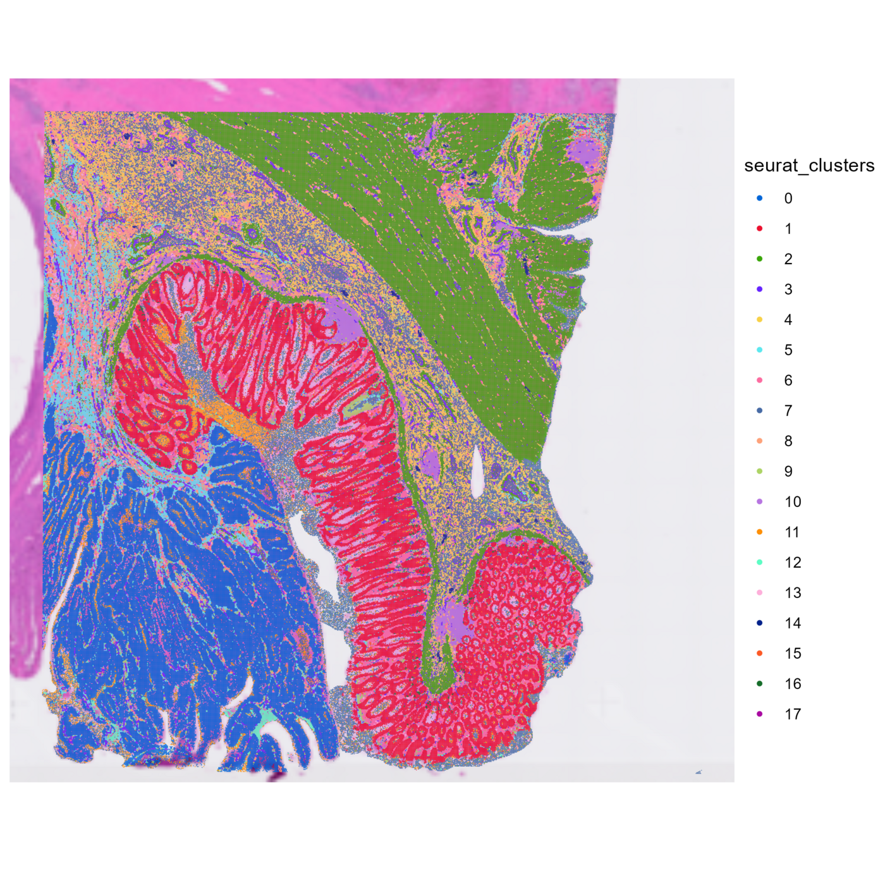
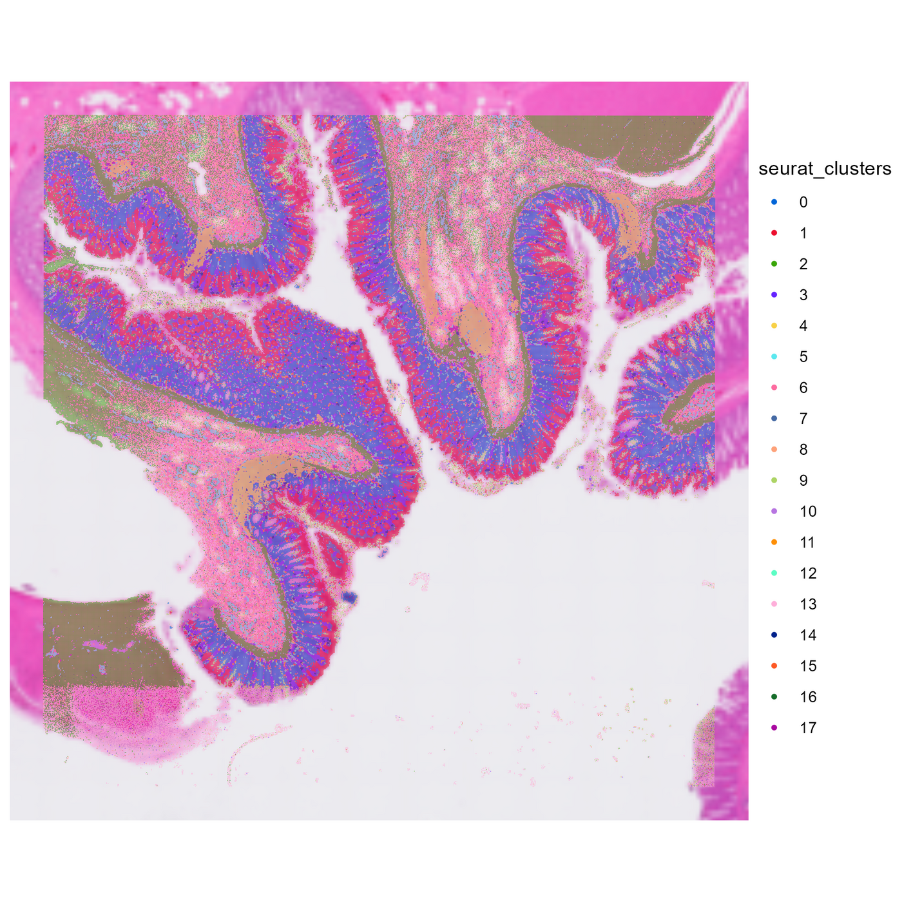
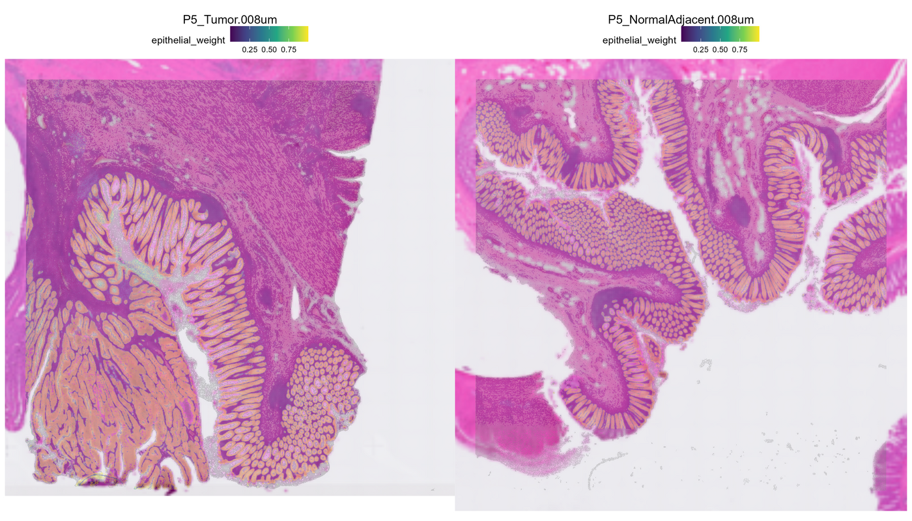
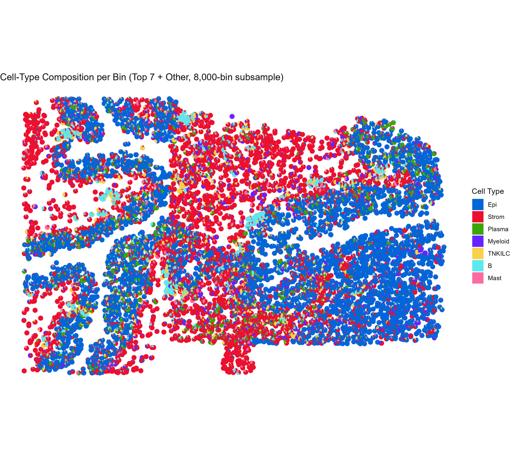
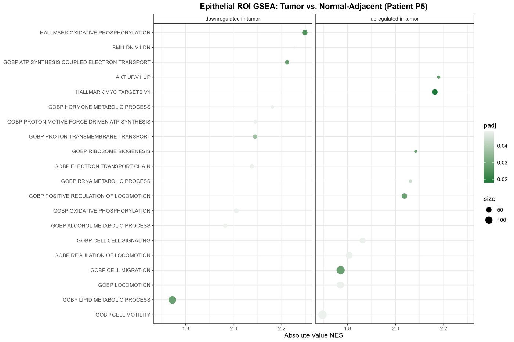

# Visium HD: Tumor vs. Normal-Adjacent Colorectal Cancer

An end-to-end spatial transcriptomics pipeline in R/Seurat, run on real
10x Genomics **Visium HD** data: matched tumor and normal-adjacent colon
tissue from the same patient, at 8µm bin resolution. The pipeline covers
loading, QC, sketch-based clustering, marker genes, sample integration,
cell-type deconvolution against a matched single-cell reference, region
subsetting, differential expression, and gene set enrichment.

## Results

The real test of this pipeline is whether its output matches known
colorectal cancer biology, not just whether the code runs. Four checks
from one full run, summarized here -- the complete figures land in
`output/figures/` after running the notebook yourself.

**Unsupervised clustering, run independently per sample, already separates
real tissue structure before any cell-type label exists.** Sketch-based
Louvain clustering (Section 5) -- no single-cell integration, no
reference, just each sample's own 8µm-bin expression -- recovers spatially
coherent domains that line up with real histology: a solid block driven by
smooth-muscle genes traces the muscularis, separate epithelial clusters
trace the crypts/glands, and the tumor sample's dominant epithelial region
shows the irregular, cribriform (gland-in-gland) architecture typical of
adenocarcinoma, next to the regularly spaced, uniform crypts on the
normal-adjacent side:

<table>
<tr>
<td width="50%"></td>
<td width="50%"></td>
</tr>
<tr>
<td align="center"><sub><b>P5_Tumor</b></sub></td>
<td align="center"><sub><b>P5_NormalAdjacent</b></sub></td>
</tr>
</table>

*Sketch-based analysis of Visium HD data without integration of single-cell
data. Spatial plots with 8µm bins colored by unsupervised ("level 1")
clustering, run separately per sample. Cell-type labels in the tables below
are assigned post hoc from canonical marker genes (`FindAllMarkers` on the
sketch, cross-checked against a textbook colorectal/immune panel -- see
Section 6 and the `marker-sanity-check` chunk in the notebook), not
produced by the clustering itself.*

Tumor and normal-adjacent are clustered **independently** at this stage --
integration across samples doesn't happen until Section 7 -- so cluster
numbers and colors are *not* comparable between the two panels: cluster 6,
for example, is B cells in the tumor sample but fibroblast in
normal-adjacent. Only clusters with a significant hit for at least one of
26 canonical marker genes are labeled below; the rest are real, spatially
distinct clusters that this coarse 7-category marker panel doesn't resolve
on its own (full per-bin cell-type assignment comes later from RCTD
deconvolution against a matched single-cell reference -- see the next
result below).

<details>
<summary><b>Tumor (P5_Tumor) cluster color legend</b></summary>
<br>

| Cluster | Color | Tissue / cell type | Marker genes |
|---|---|---|---|
| 0 | blue | Epithelium | CDH1, CEACAM5, EPCAM, KRT8, KRT20 |
| 1 | red | Epithelium (2nd subpopulation) | KRT19 |
| 2 | green | Smooth muscle (muscularis) | ACTA2, MYH11 |
| 3 | purple | Endothelium + fibroblast | CLDN5, PECAM1, VWF, DCN |
| 4 | yellow | Fibroblast | COL1A1, COL1A2, COL3A1 |
| 6 | pink | B cells | CD79A |
| 9 | olive | Myeloid | CD14, CD68 |
| 10 | lavender | B cells + T cells | MS4A1, CD2 |

Clusters 5, 7, 8, 11-17 had no significant hit among the 26 canonical genes
tested and aren't labeled here.
</details>

<details>
<summary><b>Normal-adjacent (P5_NormalAdjacent) cluster color legend</b></summary>
<br>

| Cluster | Color | Tissue / cell type | Marker genes |
|---|---|---|---|
| 0 | blue | Epithelium | CDH1, EPCAM, KRT8 |
| 1 | red | Epithelium (2nd subpopulation) | CEACAM5, KRT19, KRT20 |
| 2 | green | Smooth muscle (muscularis) | ACTA2, MYH11 |
| 3 | purple | B cells + endothelium + fibroblast | CD79A, CLDN5, COL3A1 |
| 4 | yellow | B cells + T cells + myeloid | MS4A1, CD2, CD3D, CD3E, LYZ |
| 5 | cyan | Endothelium | PECAM1, VWF |
| 6 | pink | Fibroblast | COL1A1, COL1A2, DCN |
| 7 | steel blue | Myeloid | CD14, CD68 |

Clusters 8-17 had no significant hit among the 26 canonical genes tested
and aren't labeled here.
</details>

**Deconvolution tracks the actual tissue, not just the expression
matrix.** Overlaying RCTD's per-bin epithelial weight on the source H&E
image shows the predicted epithelium tracing the visible gland/crypt
structures almost exactly, in both the disorganized tumor glands and the
regularly spaced normal crypts:



**Cell-type composition resolves real spatial domains.** A per-bin
composition breakdown (top 7 cell types + other) shows epithelium and
stroma occupying distinct, spatially coherent regions rather than a
speckled or random mix, with the sparser immune populations (Plasma,
Myeloid, TNKILC*, B, Mast) concentrated in pockets rather than smeared
uniformly across the tissue (* T cells, NK (Natural Killer) cells, and ILCs (Innate Lymphoid Cells)):



**GSEA on the tumor-vs-normal DE genes recovers textbook CRC biology.**
Ranking all 1,123 DE-tested genes from the epithelial ROI by effect size
and running `fgseaMultilevel` against MSigDB Hallmark + GO:BP (106 of 768
tested pathways significant at padj <= 0.2) surfaces several independent,
well-established cancer hallmarks that nothing in the pipeline was told to
expect: MYC target genes up in tumor (Wnt/APC-driven MYC activation is one
of the best-characterized drivers in CRC), oxidative phosphorylation and
electron-transport-chain gene sets down in tumor (the Warburg effect), and
ribosome biogenesis / rRNA metabolism plus cell migration / locomotion up
in tumor (proliferation and invasion signatures):



That convergence with known biology -- from a pipeline that never sees a
"cancer" label until the deconvolution reference is loaded -- is the
strongest evidence in this repo that it's measuring something real rather
than an artifact of the processing.

## Data

**Spatial (Visium HD, 8µm bins).** Patient P5 from Oliveira et al. 2025,
*Nature Genetics*, "High-definition spatial transcriptomic profiling of
immune cell populations in colorectal cancer" (10x Genomics). Two
samples from the same patient:

| Sample | GEO accession | Condition |
|---|---|---|
| P5 tumor | [GSM8594569](https://www.ncbi.nlm.nih.gov/geo/query/acc.cgi?acc=GSM8594569) | Colorectal cancer |
| P5 normal-adjacent | [GSM8594571](https://www.ncbi.nlm.nih.gov/geo/query/acc.cgi?acc=GSM8594571) | Normal-adjacent colon |

Full series: [GSE280315](https://www.ncbi.nlm.nih.gov/geo/query/acc.cgi?acc=GSE280315) (part of superseries [GSE280318](https://www.ncbi.nlm.nih.gov/geo/query/acc.cgi?acc=GSE280318)).

**Single-cell reference (for deconvolution).** Pelka et al. 2021, *Cell*,
"Spatially organized multicellular immune hubs in human colorectal
cancer" -- 371,223 cells from 65 patients, tumor and normal-adjacent,
with published cell-type annotations. [GSE178341](https://www.ncbi.nlm.nih.gov/geo/query/acc.cgi?acc=GSE178341).

Both datasets are public GEO deposits attached to peer-reviewed papers;
cite both if you build on this work.

## Repo structure

```
setup.R                       installs every R package these notebooks need
download_data.sh              fetches both Visium HD samples + the scRNA reference from GEO
analysis/
  01_reference_prep.Rmd       builds the RCTD reference from the Pelka atlas
  02_visium_hd_analysis.Rmd   the main pipeline: load -> QC -> cluster -> deconvolve -> DE -> GSEA
docs/
  fastq_primer.md             what's upstream of this pipeline: FASTQ format, and how to make your own
  img/                        result figures embedded in this README (committed, unlike output/)
scripts/
  make_toy_fastq.py               generates a tiny synthetic FASTQ pair (companion to the primer above)
  validate_pipeline_logic.R       dev-time smoke test: runs the notebooks' Seurat logic against
                                   small synthetic data to catch API/ordering bugs before touching
                                   real data -- not part of the analysis itself, kept for reference
data/                         not tracked in git -- populated by download_data.sh
output/                       not tracked in git -- figures, tables, and saved objects land here
```

## Running it

```bash
Rscript setup.R          # installs packages (~15-30 min the first time)
bash download_data.sh    # ~1.6 GB total download
```

Then open and knit, in order: `analysis/01_reference_prep.Rmd`, then
`analysis/02_visium_hd_analysis.Rmd`.

**Hardware.** Visium HD at 8µm bin resolution is ~130K-400K bins per
sample -- far more than standard Visium's few thousand spots. Both
notebooks use Seurat v5's official ["sketch" workflow](https://satijalab.org/seurat/articles/seurat5_sketch_analysis)
(subsample ~50K representative bins for clustering, then project labels
back onto the full set) rather than clustering every bin directly, which
is the current recommended approach for data at this scale. Even so,
budget at least 16GB of RAM and expect the full run to take a while --
this is genuinely heavier than a standard Visium analysis. Marker-gene
testing in particular is much faster with the optional
[`presto`](https://github.com/immunogenomics/presto) package installed
(needs a working Rtools/compiler toolchain) -- see the design note
below for what the notebook does if you don't have it.

## Notable design choices

- **Matched tumor/normal-adjacent pair, not a public "demo" single
  sample.** 10x's own Visium HD dataset pages are single-sample
  showcases; this analysis instead uses the full published study behind
  one of those showcases, which includes a same-patient tumor vs.
  normal-adjacent pair -- a real two-condition comparison, the same
  shape as a treated-vs-control design.
- **Marker-gene testing runs on the clustering sketch, not every bin,
  when `presto` isn't available.** `FindAllMarkers`'s fallback
  implementation (used without `immunogenomics/presto`) is
  single-threaded and scales with cell count -- timed directly, it was
  still on cluster 0 of 18 after 15+ minutes against the full
  ~510,000-bin tumor sample, extrapolating to multiple hours for the
  whole notebook. Both marker-gene chunks instead test against the same
  ~50,000-bin leverage-score sketch already used for clustering, which
  is Seurat's own documented pattern for this exact situation, cutting
  that step to about 5 minutes. This changes *which* genes get flagged
  as markers, not the expression values plotted -- and it's checked,
  not just assumed: each sample's marker step is immediately followed
  by a `marker-sanity-check` chunk that tests the result against
  textbook colorectal/immune marker genes (EPCAM, COL1A1, PECAM1,
  CD3/CD79A, etc.) and confirms they land on biologically coherent,
  non-scattered clusters rather than noise. If you have `presto`
  installed and want every bin tested directly instead, swap
  `tumor_for_markers` / `normal_for_markers` back to `tumor` / `normal`
  in those two chunks.
- **After merging, only variable-feature genes get scaled, not every
  gene.** Section 7 merges both samples into one ~917,000-bin object.
  Scaling every gene (`ScaleData` with `features = rownames(...)`, the
  same call each per-sample section used successfully at ~400-540K bins)
  hit an out-of-memory crash at this larger combined size -- a dense
  scale.data matrix across all ~18,000 genes x ~917,000 bins needs on
  the order of 130GB for that matrix alone. Checked before working
  around it: nothing downstream (`FindMarkers` in Section 13,
  `SpatialFeaturePlot`, `SpatialDimPlot`, GSEA) actually reads the
  scale.data slot -- they all default to the normalized "data" slot --
  so the merged object instead scales only the ~2,000 variable features
  already selected for clustering, which is Seurat's own default
  behavior and needed for nothing to change downstream, just skipped
  for genes nothing reads it from anyway.
- **RCTD deconvolution capped at 4 parallel workers, not
  `detectCores() - 1`.** RCTD spins up one PSOCK worker per core; on a
  28-core/64GB machine, the default (27 workers) crashed with `Error in
  serialize(data, node$con) : error writing to connection`, alongside a
  "sparse->dense coercion: allocating vector of size 3.2 GiB" warning --
  27 workers each occasionally allocating multiple GB at once pushed
  total memory demand past available RAM (confirmed directly: total
  physical memory queried via `system('powershell -Command
  "(Get-CimInstance Win32_ComputerSystem).TotalPhysicalMemory"')`, since
  `memory.limit()` is deprecated in modern R and `wmic` wasn't available
  on this Windows build). This is a known PSOCK failure mode when workers
  collectively exhaust memory, not an issue with the data or the RCTD
  call. Capping `max_cores` at 4 fixed it -- identical inputs ran to
  completion. This trades some parallel speed for headroom; if your
  machine has more RAM to spare, `analysis/02_visium_hd_analysis.Rmd`
  notes where to raise it back toward `detectCores() - 1`.
- **Deconvolution results cover 69% of bins, not all of them -- by
  design, not by failure.** RCTD's `create.RCTD()` defaults to
  `UMI_min = 100` and drops any bin under that total-count floor before
  fitting. In this run that's 630,682 of 917,346 bins (69%); confirmed
  directly, not assumed -- `length(myRCTD@spatialRNA@nUMI)` and
  `sum(nUMI_spatial < 100)` both land on the same 286,664-bin gap. An
  8um bin is small enough that background and inter-cellular-gap areas
  across two full tissue sections genuinely don't capture enough
  transcripts to deconvolve reliably, so the floor is filtering out
  noise, not discarding usable signal. The excluded bins end up with
  `NA` cell-type-weight metadata rather than zeros, and downstream steps
  (the epithelial ROI in Section 12 especially) drop those `NA` rows on
  their own rather than needing special-casing.
- **Deconvolution reference matched to tissue type.** RCTD needs an
  annotated single-cell reference; Pelka et al.'s CRC atlas is used
  because it's the same tissue type (human colon, tumor + normal) rather
  than a generic or mismatched-tissue atlas.
- **Species-appropriate gene-naming conventions.** Human mitochondrial
  genes are `MT-` (e.g. `MT-ND1`), not the mouse `mt-` convention, and
  human annotation doesn't use the mouse-specific `Gm#####` /
  `*Rik` naming for uncharacterized genes -- QC and filtering steps are
  written for human gene symbols rather than ported blind from a
  mouse pipeline.
- **Most tested genes clear the significance bar in the tumor-vs-normal DE
  test -- expected at this sample size, not a red flag.** The epithelial-ROI
  comparison (Section 13) tests ~295,000 individual 8um bins with a per-bin
  Wilcoxon test (168,240 tumor, 127,089 normal-adjacent); confirmed directly
  from that run, 1,053 of 1,123 tested genes (94%) reach `p_val_adj <= 0.05`.
  At that n, statistical power is enormous, so this high a hit rate is the
  expected consequence of the sample size, not a sign the test is broken.
  It's also the appropriate design here: with one tumor and one
  normal-adjacent sample from a single patient, there's no second patient to
  pseudobulk across, so per-bin testing -- treating each bin as the unit of
  comparison, the same convention used for per-cell DE in single-sample
  scRNA-seq -- is the accepted approach for a matched pair like this, not a
  shortcut. The practical consequence is that `p_val_adj` alone barely
  discriminates among tested genes at this scale, which is why both the
  top-hits table and the GSEA ranking (next bullet) are ordered by effect
  size (`avg_log2FC`) rather than by p-value, with the significance filter
  and the pre-existing `min.pct`/`logfc.threshold` expression filters doing
  the work of excluding noise.
- **GSEA ranks the full tested gene list**, not only the
  significance-filtered subset, per standard `fgsea` practice.

## License / attribution

Code in this repo: MIT (see `LICENSE`). The underlying data is not
redistributed here (see `download_data.sh`) and remains subject to its
original GEO/publication terms -- cite Oliveira et al. 2025 and Pelka et
al. 2021 if you reuse it.
